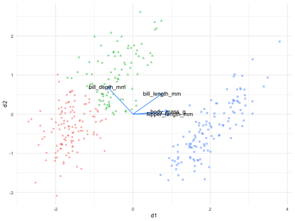

```{r setup, include=FALSE}
options(htmltools.dir.version = FALSE)
xaringanExtra::use_animate_css()
# xaringanExtra::use_scribble()
knitr::opts_chunk$set(
  fig.width = 8, fig.height = 6, fig.retina=5,
  out.width = "75%",
  cache = FALSE,
  echo = TRUE,
  message = FALSE, 
  warning = FALSE,
  hiline = TRUE
)


```

```{r, load_refs, include=FALSE, cache=FALSE}
# remotes::install_github("ROpenSci/bibtex")
library(RefManageR)
BibOptions(check.entries = FALSE,
       bib.style = "authoryear",
       cite.style = "authoryear",
       style = "markdown",
       hyperlink = FALSE,
       dashed = FALSE)
ifcs_bib <- ReadBib("ifcs22_references.bib", check = FALSE)
```

```{r xaringan-themer, include=FALSE, warning=FALSE}
library(xaringanthemer)
library(xaringanExtra)
library(FactoMineR)
library(GGally)
library("gganimate")
library(ggrepel)
library(magick)
library(palmerpenguins)
library(fastDummies)
library(mlbench)
library(tidyverse)
library(tidymodels)
library(purrr)
library(ca)
library("magick")
library(tidymodels)
library(discrim)
library(clustrd)
library(flipbookr)
library(kableExtra)
library(janitor)
library(patchwork)
library(mvtnorm)
source("R/plot_ca_da.r")
source("R/out_of_independence.r")
style_duo_accent(primary_color = "#F9B76C",
                 secondary_color = "#37499c",
                 # title_slide_background_image = "./figures/compstat22_logo.png",
                 # title_slide_background_position = "top",
                 # title_slide_background_size= "100%",
                 title_slide_text_color = "#37499c",
                 code_font_size  = "0.7rem",
                 code_highlight_color="#E4F6EF",
                 header_color = "#37499c"
                 )
                 
style_extra_css(css = list(
  ".my-pull-left"= list(float= "left",
                         width = "10%"),
  ".my-pull-right"= list(float= "right",
                          width = "89%"),
  ".my-pull-right + *" = list(clear = "both")
  ),
  outfile = "xaringan-themer.css",
  append = TRUE)


xaringanExtra::use_tile_view()
```

class: animated fadeIn 

### stacked data reduction (stacked DR)
- <h4 style = "color:#37499c"> variables and sample reduction </h4>

- <h4 style = "color:#37499c"> the tandem approach and  cluster masking problem </h4>

--

### joint DR
- <h4 style = "color:#37499c"> a unified framework for continuous, categorical and mixed data </h4>

--

### biplots in joint DR for cluster characterization

- <h4 style = "color:#37499c"> discriminant analysis biplot, contribution biplot </h4>


---
class: animated fadeIn inverse center middle

## stacked DR
### also known as 
###  the tandem approach

---
class: animated fadeIn middle

### data reduction paradigm

 **summarising** a two-way data matrix by **aggregating measurements** 
`r Citep(bib = ifcs_bib, "farcomeni2016robust")`

- column-wise reduction: define a limited number of linear combinations (**dimension reduction**)

- row-wise reduction: define a limited number of observations, each representative of an homogeneous group (**partitioning clustering**)

---
class: animated fadeIn
### continuous data case: principal component analysis `r Citep(bib=ifcs_bib,"jolliffe2002principal",before="PCA, ")`


${\bf X}$ is the $n \times p$ standardized data matrix

The PCA loss function can be defined as:

**
$$\min_{\mathbf{A,B}}\left\Vert \mathbf{Y}-n^{1/2}\mathbf{AB}^{\sf T}p^{1/2}\right\Vert ^{2} \ \ s.t. \ \
p\mathbf{B}^{\sf T}\mathbf{B}=\mathbf{I}_{d}$$
**

where $\mathbf{Y}=n^{-1/2}\mathbf{X}p^{-1/2}$.

--

- the columns of $\mathbf{A}=n^{1/2}\mathbf{\tilde{U}{\bf \tilde{D}}_{\alpha}}$ are the row (principal) coordinates, and they are such that
$\frac{1}{n}\mathbf{A}^{\sf T}\mathbf{A}={\bf \tilde{D}}_{\alpha}^{2}$

- the columns of $\mathbf{B}=p^{1/2}{\bf \tilde{V}}$ are the column (standard) coordinates

--

Since ${\bf \tilde{U}}{\bf \tilde{D}_{\alpha}}{\bf \tilde{V}^{{\sf T}}}$ is the $d$-truncated SVD of $\bf{Y}$, then
$n^{1/2}\mathbf{AB}^{\sf T}p^{1/2}$ is the best rank- $d$ approximation of $\bf{Y}$, in the least square sense.


---
class: animated fadeIn
### categorical data case:  correspondence analysis `r Citep(bib=ifcs_bib,"Gre07",before="CA, ")`


${\bf P}$ is a two-way table with relative frequencies, crossing two categorical variables, with  $q_{r}$ and $q_{c}$ categories

The CA loss function is:

**
$$\min_{\mathbf{A,B}}\left\Vert \mathbf{\tilde{P}-D}_{r}^{1/2}\mathbf{AB}^{\sf T}\mathbf{D}_{c}^{1/2}\right\Vert ^{2} \ \ s.t. \ \
\mathbf{B}^{\sf T}\mathbf{D}_{c}\mathbf{B}=\mathbf{I}_{d}$$
**

where $\mathbf{\tilde{P}=D}_{r}^{-1/2}\left(\mathbf{P}-\mathbf{rc}^{\sf T}\right)\mathbf{D}_{c}^{-1/2}$ , $\mathbf{r=P1}_{q_c}$ , $\mathbf{c} =\mathbf{P}^{\sf T}\mathbf{1}_{q_r}$,
$\mathbf{D}_{r}=diag(\mathbf{r})$, $\mathbf{D}_{c} = diag(\mathbf{c})$ 

--

- the columns of $\mathbf{A=D}_{r}^{-1/2}\mathbf{\tilde{U}{\bf \tilde{D}}_{\alpha}}$ are the row (principal) coordinates, and they are such that
$\mathbf{A}^{\sf T}\mathbf{D}_{r}\mathbf{A={\bf D}_{\alpha}}^{2}$

- the columns of $\mathbf{B=D}_{c}^{-1/2}\mathbf{\tilde{V}}$ are the column (standard) coordinates

--

Since ${\bf \tilde{U}}{\bf \tilde{D}_{\alpha}}{\bf \tilde{V}^{{\sf T}}}$ is the $d$-truncated SVD of $\bf{\tilde{P} }$, then
$\mathbf{D}_{r}^{1/2}\mathbf{AB}^{\sf T}\mathbf{D}_{c}^{1/2}$ is the best rank- $d$ approximation of $\bf{\tilde{P} }$, in the least square sense.


---
class: animated fadeIn
### categorical data case: (multiple) correspondence analysis

MCA generalizes the application of CA to $p$ categorical variables, each with $q_{j}$ categories, $j=1,\ldots,p$.

- ${\bf Z}^{\star}_{j}$ is the one-hot-encoding of the $j^{th}$ categorical variable.

- ${\bf Z}^{\star}=[{\bf Z}^{\star}_{1},\ldots,{\bf Z}^{\star}_{p}]$ and ${\bf Z}=\frac{ {\bf Z}^\star}{n\times Q}$, with $Q=\sum_{j=1}^{p}{q_{j}}$; 

- the margins are ${\bf r}=\frac{1}{n}{\bf 1}_{n}$ and ${\bf s}={\bf Z}^{{\sf T}}{\bf 1}_{n}$  

--

The (M)CA loss function is:

**
$$\min_{\mathbf{A,B}}\left\Vert \mathbf{\tilde{Z}} - \frac{1}{\sqrt{n}}\mathbf{AB}^{\sf T}\mathbf{D}_{s}^{1/2}\right\Vert ^{2} \ \ s.t. \ \
\mathbf{B}^{\sf T}\mathbf{D}_{s}\mathbf{B}=\mathbf{I}_{d}$$
**

where $\mathbf{\tilde{Z}}=\sqrt{n}\left(\mathbf{Z}-\frac{1}{n}{\bf 1}_{n}{\bf 1}_{n}^{{\sf T}}{\bf Z}\right)\mathbf{D}_{s}^{-1/2}$

---
class: animated fadeIn
### mixed data case: factor analysis of mixed data `r Citep(bib=ifcs_bib,"escofier1979traitement",before="FAMD, ")`

Real datasets have often both continuous and categorical variables.

Upon an appropriate data pre-processing, dimension reduction is done via PCA.

--

.pull-left[
Let $\bf X$ contain the continuous variables (centered and standardised);
]

.pull-right[
Let the $\bf Z$ also be centered and standardized:

 - the centering operator is ${\bf M} = {\bf I}_{n} - n^{-1}{\bf 1}_{n}{\bf 1}^{{\sf T}}_{n}$ 
 - the scaling weights are in ${\bf D}_{z}=diag({\bf Z}^{\sf T}{\bf Z})$ 
 ]
 
--
 
The PCA of ** ${\bf X^{\star}} = \left[{\bf X} \ {\bf D}_{z}^{-1/2}{\bf Z}{\bf M}\right]$ ** is the FAMD

---
class: animated fadeIn
### partitioning cluster analysis `r Citep(bib=ifcs_bib,"MacQueen",before="K-means, ")`

Assuming to deal with continuous data, and Euclidean distances, the K-means loss function can be defined as:


**
$$\min_{ {\bf Z}_{K} } \left \Vert \mathbf{X}-{\bf Z}_{K} {\bf G} \right\Vert ^{2}$$
**

- ${\bf Z}_{K}$ is a $n\times K$ binary matrix, the dummy coding of the cluster allocation vector

- ${\bf G} = \left({\bf Z}_{K}^{\sf T}{\bf Z}_{K}\right)^{-1}{\bf Z}^{\sf T}_{K}{\bf X}$ is the  $K\times p$  matrix of cluster means


--

- **non-continuous data**

  - ad-hoc dissimilarity/distances
  - quantification

--

- **high dimensions**

  - distance between any two points tend to converge to a same quantity: curse of dimensionality
  

---
class: animated fadeIn
### curse of dimensionality?

```{r, echo=FALSE,fig.align='center',out.width="40%"}
magick::image_read_pdf("./figures/neighbours0_av.pdf",
                       pages = 1)
```

---
class: animated fadeIn
### curse of dimensionality?

```{r, echo=FALSE,fig.align='center',out.width="40%"}
magick::image_read_pdf("./figures/neighbours01_av.pdf",
                       pages = 1)
```


---
class: animated fadeIn
### curse of dimensionality?

```{r, echo=FALSE,fig.align='center',out.width="40%"}
magick::image_read_pdf("./figures/neighbours1_av.pdf",
                       pages = 1)
```

---
class: animated fadeIn
### curse of dimensionality?

```{r, echo=FALSE,fig.align='center',out.width="40%"}
magick::image_read_pdf("./figures/neighbours02_av.pdf",
                       pages = 1)
```


---
class: animated fadeIn
### curse of dimensionality?

```{r, echo=FALSE,fig.align='center',out.width="40%"}
magick::image_read_pdf("./figures/neighbours2_av.pdf",
                       pages = 1)
```

---
class: animated fadeIn
### stacking variables and samples reduction

Practitioners often apply dimension reduction and then cluster the low-dimensional scores: this approach is referred to as ** tandem analysis ** `r Citep(bib=ifcs_bib,"arabie1996advances")`

- mitigates the effects of the curse of dimensionality

- may improve clustering

- the graphical display of the dataset at hand may be of help for cluster characterization

--

**but...**

- the dimension reduction step is independent from the clustering step


---
class: animated fadeIn
### cluster masking

Consider a toy example: three very well separated clusters in two dimensions


```{r,echo=FALSE}
source("R/points_in_a_circle.R")
mat=matrix(c(2,2,5,8,6,5),ncol=2,byrow = T)
centers = tibble(c_d1=mat[,1],c_d2=mat[,2],true_cluster=letters[1:nrow(mat)]) 
# centers %>% kbl %>% kable_styling(font_size =14)
```


```{r,fig.align='center',echo=FALSE,out.width="45%",eval=TRUE,cache=FALSE}
set.seed(123)
toy_points = centers %>% mutate(
  cluster_points=map2(.x = c_d1,.y=c_d2,.f=~points_in_a_circle(c_d1=.x,c_d2=.y,n=50))
  ) %>% unnest(cluster_points) 

pca_points = toy_points %>% dplyr::select(d1,d2) %>% PCA(graph=FALSE) %>%
  .[["ind"]] %>% .[["coord"]] %>%
  as_tibble() %>% dplyr::rename(pc1=`Dim.1`,pc2=`Dim.2`) %>%
  cbind(toy_points) %>% select(pc1,pc2,true_cluster) %>% 
  dplyr::rename(d1=`pc1`,d2=`pc2`) %>% mutate(display="pca")
      
animation_points = bind_rows(toy_points  %>%
                               dplyr::select(d1,d2,true_cluster) %>% 
                               mutate(display="original"),pca_points)

pca_toy = animation_points %>% 
  ggplot(aes(x=d1,y=d2))+geom_point(aes(shape=true_cluster),alpha=.75,size=5) +
  theme_minimal() + geom_vline(xintercept=0, alpha=.75) + geom_hline(yintercept=0, alpha=.75)+
  transition_states(display,wrap = FALSE,transition_length = 1) +
    view_follow() + theme(legend.position="none")

# anim_save(filename = "./figures/pca_toy_anim.gif",pca_toy)


tandem_points = pca_points %>% 
mutate(cluster=kmeans(x=pca_points %>% dplyr::select(d1,d2),centers=3,nstart = 10)$cluster %>% as_factor() )


```


---
class: animated fadeIn
### cluster masking

the PCA scores are easily clustered via, e.g., Kmeans

```{r,fig.align='center',echo=FALSE,out.width="45%",eval=TRUE,cache=FALSE}
tandem_points %>% 
  ggplot(aes(x=d1,y=d2))+geom_point(aes(shape=true_cluster,color=cluster),alpha=.75,size=5)+
  theme_minimal() + geom_vline(xintercept=0, alpha=.75) + geom_hline(yintercept=0, alpha=.75)+
   theme(legend.position="none")

```

---
class: animated fadeIn
### cluster masking

the toy example: adding 4 noise variables  $X_{j}\sim N(0,\sigma^{2}_{j})$, $\sigma_{j}\in \left\{ 6, 9\right\}$,  $j=3,\ldots,6$ 

```{r,fig.align='center',echo=FALSE,out.width="45%",eval=TRUE,cache=FALSE}
set.seed(123)
  toy_points = centers %>% mutate(
  cluster_points=map2(.x = c_d1,.y=c_d2,.f=~points_in_a_circle(c_d1=.x,c_d2=.y,n=50))
  ) %>% unnest(cluster_points) 

# corr_1 = matrix(3,2,2)
# corr_2 = matrix(-1,2,2)
# diag(corr_1) =3
# diag(corr_2) =6
# 
# noise_vars=rmvnorm(n = nrow(toy_points),mean=c(0,0),sigma = corr_1)
# noise_vars_2=rmvnorm(n = nrow(toy_points),mean=c(0,0),sigma = corr_2)
# 
# toy_points_noise = toy_points %>% dplyr::select(d1,d2,true_cluster) %>%
#   mutate(d3=noise_vars[,1],
#          d4=noise_vars[,2],
#          d5=noise_vars_2[,1],
#          d6=noise_vars_2[,2]
#          )

toy_points_noise = toy_points %>% dplyr::select(d1,d2,true_cluster) %>%
  mutate(d3=rnorm(nrow(toy_points),0,6),
         d4=rnorm(nrow(toy_points),0,9),
         d5=rnorm(nrow(toy_points),0,6),
         d6=rnorm(nrow(toy_points),0,6)
         )
```
---
class: animated fadeIn
### cluster masking

the toy example: adding 4 noise variables  $X_{j}\sim N(0,\sigma^{2}_{j})$, $\sigma_{j}\in \left\{ 6, 9\right\}$,  $j=3,\ldots,6$

```{r,fig.align='center',echo=FALSE,out.width="45%",eval=TRUE,cache=FALSE}

toy_points_noise %>%   mutate(
cluster_full = kmeans(x=toy_points_noise %>% select(starts_with("d")), centers=3,nstart = 10)$cluster %>% as_factor()
) %>% 
  ggplot(aes(x=d1,y=d2))+geom_point(aes(shape=true_cluster,color=cluster_full),alpha=.75,size=5)+
  theme_minimal() + geom_vline(xintercept=0, alpha=.75) + geom_hline(yintercept=0, alpha=.75)+
   theme(legend.position="none")+ggtitle("Kmeans results in full dimensions")


# sc_toy_points_noise = toy_points_noise %>% dplyr::select(starts_with("d")) %>% 
#   mutate(across(everything(),.fns= ~scale(.x)))
# 
# 
# write.csv(file = "data/toy_points_noise.csv", x = sc_toy_points_noise)

pca_points = toy_points_noise %>% dplyr::select(starts_with("d")) %>% PCA(graph=FALSE,ncp = 6) %>%
  .[["ind"]] %>% .[["coord"]] %>%
  as_tibble() %>% dplyr::rename(pc1=`Dim.1`,pc2=`Dim.2`,
                                pc3=`Dim.3`,pc4=`Dim.4`,
                                pc5=`Dim.5`,pc6=`Dim.6`) %>%
  cbind(toy_points) %>% select(pc1:pc6,true_cluster) %>% 
  dplyr::rename(d1=`pc1`,d2=`pc2`) %>% mutate(display="pca")


animation_points = bind_rows(toy_points_noise  %>%
                               dplyr::select(d1,d2,true_cluster) %>% 
                               mutate(display="original"),pca_points %>% 
                               dplyr::select(d1,d2,true_cluster,display))

tandem_toy = animation_points %>% 
  ggplot(aes(x=d1,y=d2))+geom_point(aes(shape=true_cluster),alpha=.75,size=5)+
  theme_minimal() + geom_vline(xintercept=0, alpha=.75) + geom_hline(yintercept=0, alpha=.75)+
  transition_states(display,wrap = FALSE,transition_length = 1) +
    view_follow() + theme(legend.position="none")
```

---
class: animated fadeIn
### cluster masking

The tandem approach: the 2-d PC map

```{r,fig.align='center',echo=FALSE,out.width="45%",eval=TRUE,cache=FALSE}
 # anim_save(filename = "./figures/tandem_toy_anim.gif",tandem_toy)


tandem_points = pca_points %>% 
mutate(
  cluster_2d=kmeans(x=pca_points %>% dplyr::select(d1,d2),centers=3,nstart = 10)$cluster %>% as_factor(), 
  cluster_3d=kmeans(x=pca_points %>% dplyr::select(d1:pc3),centers=3,nstart = 10)$cluster %>% as_factor(),
  cluster_4d=kmeans(x=pca_points %>% dplyr::select(d1:pc4),centers=3,nstart = 10)$cluster %>% as_factor(),
  cluster_5d=kmeans(x=pca_points %>% dplyr::select(d1:pc5),centers=3,nstart = 10)$cluster %>% as_factor(),
  cluster_6d=kmeans(x=pca_points %>% dplyr::select(d1:pc6),centers=3,nstart = 10)$cluster %>% as_factor())


```

---
class: animated fadeIn
### cluster masking

The tandem approach will fail: the 2-d PC map does not display clustered observations

```{r,fig.align='center',echo=FALSE,out.width="45%",eval=TRUE,cache=FALSE}

tandem_points %>% mutate(od1=toy_points_noise$d1,
                         od2=toy_points_noise$d2) %>% 
  ggplot(aes(x=d1,y=d2))+geom_point(aes(shape=true_cluster,color=cluster_2d),alpha=.75,size=5)+
  theme_minimal() + geom_vline(xintercept=0, alpha=.75) + geom_hline(yintercept=0, alpha=.75)+
  theme(legend.position="none")
```
---
class: animated fadeIn
### cluster masking

The tandem approach will fail: K-means considering an increasing number of PCs

```{r,fig.align='center',echo=FALSE,out.width="45%",eval=TRUE,cache=FALSE}
tandem_points %>% mutate(od1=toy_points_noise$d1,
                         od2=toy_points_noise$d2) %>% 
  ggplot(aes(x=od1,y=od2))+geom_point(aes(shape=true_cluster,color=cluster_3d),alpha=.75,size=5)+
  theme_minimal() + geom_vline(xintercept=0, alpha=.75) + geom_hline(yintercept=0, alpha=.75)+
  theme(legend.position="none")+ggtitle("Kmeans results on 3 pc's")
```


---
class: animated fadeIn
### cluster masking

The tandem approach will fail: K-means considering an increasing number of PCs

```{r,fig.align='center',echo=FALSE,out.width="45%",eval=TRUE,cache=FALSE}
tandem_points %>% mutate(od1=toy_points_noise$d1,
                         od2=toy_points_noise$d2) %>% 
  ggplot(aes(x=od1,y=od2))+geom_point(aes(shape=true_cluster,color=cluster_4d),alpha=.75,size=5)+
  theme_minimal() + geom_vline(xintercept=0, alpha=.75) + geom_hline(yintercept=0, alpha=.75)+
  theme(legend.position="none")+ggtitle("Kmeans results on 4 pc's")
```

---
class: animated fadeIn
### cluster masking

The tandem approach will fail: K-means considering an increasing number of PCs

```{r,fig.align='center',echo=FALSE,out.width="45%",eval=TRUE,cache=FALSE}
tandem_points %>% mutate(od1=toy_points_noise$d1,
                         od2=toy_points_noise$d2) %>% 
  ggplot(aes(x=od1,y=od2))+geom_point(aes(shape=true_cluster,color=cluster_5d),alpha=.75,size=5)+
  theme_minimal() + geom_vline(xintercept=0, alpha=.75) + geom_hline(yintercept=0, alpha=.75)+
  theme(legend.position="none")+ggtitle("Kmeans results on 5 pc's")
```


---
class: animated fadeIn
### cluster masking

The tandem approach will fail: K-means considering an increasing number of PCs

```{r,fig.align='center',echo=FALSE,out.width="45%",eval=TRUE,cache=FALSE}
tandem_points %>% mutate(od1=toy_points_noise$d1,
                         od2=toy_points_noise$d2) %>% 
  ggplot(aes(x=od1,y=od2))+geom_point(aes(shape=true_cluster,color=cluster_6d),alpha=.75,size=5)+
  theme_minimal() + geom_vline(xintercept=0, alpha=.75) + geom_hline(yintercept=0, alpha=.75)+
  theme(legend.position="none")+ggtitle("Kmeans results on 6 pc's")
```


---
class: animated fadeIn inverse center middle

## joint data reduction (JDR)


---
class: animated fadeIn

### Beyond tandem analysis: joint methods

**Methods for continuous data**


- **Reduced K-means** `r Citep(bib = ifcs_bib, "De_Soete")`: joint PCA + Kmeans
- **Factorial K-means** `r Citep(bib = ifcs_bib, "vichi2001factorial")`: joint PCA + Kmeans

**Methods for categorical data**


- **MCA-Kmeans** `r Citep(bib = ifcs_bib, "Hwang")`: joint MCA + Kmeans
- **iFCB** `r Citep(bib = ifcs_bib, "iodice2013iterative")`: iterative sequential NSCA + Kmeans
- **Cluster Correspondence Analysis** `r Citep(bib = ifcs_bib, "van_de_velden17")`: joint CA + Kmeans

**Methods for mixed data**

- **CDR** `r Citep(bib=ifcs_bib, "vichi2019clustering",before="cluster and dimension reduciton for mixed data, ")`
- **Groupals** `r Citep(bib=ifcs_bib, "van1989clust")`


--
All methods are implemented in $\texttt{CRAN}$ package $\texttt{clustrd}$ `r Citep(bib = ifcs_bib,"Mark_clustrd")`

---
class: animated fadeIn
### JDR: a unified framework

The general objective can be formulated as follows `r Citep(bib = ifcs_bib, "yamamoto2014general","vichi2019clustering")`:
 
 **
 $$
 \min\phi\left(\mathbf{B},\mathbf{Z}_{K}\right)=
 \alpha\left\Vert\mathbf{X} - \mathbf{X}\mathbf{B}\mathbf{B}^{\sf T}\right\Vert ^{2} +
 (1-\alpha)\left\Vert\mathbf{XB} - \mathbf{P}\mathbf{X}\mathbf{B}\right\Vert ^{2} 
 $$
 **
 

$\mathbf{B}$ is the loadings matrix

$\mathbf{P} = \mathbf{Z}_{K}\left(\mathbf{Z}_{K}^{\sf T}\mathbf{Z}_{K}\right)^{-1}\mathbf{Z}_{K}^{\sf T}$

- $\alpha = 1/2$, **Reduced K-means**
- $\alpha = 0$, **Factorial K-means**

Note that $\alpha = 1$ gives the PCA solution.

---
class: animated fadeIn
### JDR: a unified framework

**
$$
\min\phi\left(\mathbf{B},\mathbf{Z}_{K}\right)=
\alpha\left\Vert\mathbf{X} - \mathbf{X}\mathbf{B}\mathbf{B}^{\sf T}\right\Vert ^{2} +
(1-\alpha)\left\Vert\mathbf{XB} - \mathbf{P}\mathbf{X}\mathbf{B}\right\Vert ^{2}
$$
**

**Extensions to categorical data**

$$\mathbf{X}^{cat} = \mathbf{D}_{z}^{-1/2}\mathbf{MZ}$$

- $\alpha = 1/2$, Cluster Correspondence Analysis

**Extensions to mixed-type data**
$$\mathbf{X}^{mix} = \left[\mathbf{X}^{cnt} \hspace{.35cm}  \mathbf{X}^{cat}\right]$$

- $\alpha = 1/2$, Mixed Reduced K-means
- $\alpha = 0$, Mixed Factorial K-means

Note that $\alpha = 1$ gives the PCAMIX/FAMD solution.

---
class: animated fadeIn
### JDR: a unified procedure


For given $\alpha$, the following ALS algorithm is used to minimize the loss function:


- Generate an initial cluster allocation $\mathbf{Z}_{K}$ (e.g., by randomly assigning subjects to clusters).
	
- Find loadings $\mathbf{B}$ by taking the eigendecomposition of $\mathbf{X}^{\sf T}\left((1-\alpha)\mathbf{P} - (1-2\alpha)\mathbf{I}\right)\mathbf{X}$
	
- Update the cluster allocation $\mathbf{Z}_{K}$ by applying K-means to the reduced space subject coordinates $\mathbf{X}\mathbf{B}$
	
- Repeat the procedure (i.e. go back to step 2) using $\mathbf{Z}_{K}$ for the cluster allocation matrix, until convergence (clusters stay the same). 


---
class: animated fadeIn

### JDR on the toy data set: no more cluster masking

```{r, echo=FALSE, fig.align='center',message=FALSE,out.width="45%",cache=FALSE}

fkm_scores = read.csv(file = "data/toy_FKM_scores.csv",sep = ";") %>% as_tibble()%>% 
  mutate(cluster=rep(c("a","b","c"),each=50))

fkm_scores %>% ggplot(aes(x = d1, y = d2)) + 
  geom_point(aes(color=cluster,shape=cluster),alpha=.75,size=5) + 
  theme_minimal() + geom_vline(xintercept=0, alpha=.75) + geom_hline(yintercept=0, alpha=.75)+
  theme(legend.position="none")+ggtitle("FKM results")


```


---
class: animated fadeIn inverse center middle

## biplots in JDR
### for
### cluster characterization

---
class: animated fadeIn 
### The Palmer Penguins data set (not iris) `r Citep(bib=ifcs_bib,"pengs")`

.pull-left[

** 342 ** penguins from three species

** 4 ** variables
  - bill length and depth 
  - body mass 
  - flipper length

]

.pull-right[
```{r, echo=FALSE, fig.align='center',message=FALSE,out.width="65%",cache=FALSE}

```
]
 

&nbsp;

.center[

```{r, echo=FALSE, fig.align='center',message=FALSE,out.width="65%",cache=FALSE}
pengs = penguins %>% select(species,ends_with("_mm"),ends_with("_g")) %>% na.omit
table(pengs$species) %>% kbl(col.names = c("species","n")) 
```

]

---
class: animated fadeIn 
### The Palmer Penguins: tandem 

```{r, echo=FALSE, fig.align='center',message=FALSE,out.width="55%",cache=FALSE}
set.seed(1234)

pca_pengs = PCA(pengs %>% select(ends_with("_mm"),ends_with("_g")),graph=FALSE)
kmeans_sol = kmeans(pca_pengs$ind$coord[,1:2],3,2,nstart=100)$cluster  

scores_pca = pca_pengs$ind$coord %>% as_tibble() %>% select(1,2) %>% rename(d1=Dim.1,d2=Dim.2)%>%
  mutate(cluster = fct_inorder(factor(kmeans_sol)),
         cluster=fct_recode(cluster,a="2",b="1",c="3"),
         mtd="tandem",what="obs", true_cluster = pengs %>% pull(species))

# conf_mat_pca = table(scores_pca$cluster,scores_pca$true_cluster)
# conf_mat_pca =  scores_pca %>% conf_mat(truth = cluster, true_cluster,)

scores_rkm = read.csv("data/penguin_scores_RKM.csv",sep=";") %>% 
  mutate(cluster=factor(cluster),
  cluster=fct_recode(cluster,a="1",b="2",c="3"),
  mtd="rkm",what="obs",d2 = d2*-1, true_cluster = pengs %>% pull(species))
   
# conf_mat_rkm = table(scores_rkm$cluster,scores_rkm$true_cluster)
# conf_mat_rkm =  scores_rkm %>% conf_mat(truth = cluster, true_cluster)

scores_fkm = read.csv("data/penguin_scores_FKM.csv",sep=";")%>% 
  mutate(cluster=factor(cluster),
         cluster=fct_recode(cluster,a="1",b="2",c="3"),
         mtd="fkm",what="obs",true_cluster = pengs %>% pull(species))

conf_mat_fkm = table(scores_fkm$cluster,scores_fkm$true_cluster)           
# conf_mat_fkm =  scores_fkm %>% conf_mat(truth = cluster, true_cluster)

vars_rkm = read.csv("data/vars_penguin_RKM.csv",sep=";") %>% mutate(mtd="rkm",what="vars",d2 = d2*-1)
vars_fkm = read.csv("data/vars_penguin_FKM.csv",sep=";") %>% mutate(mtd="fkm",what="vars") %>% rename(varname=var_names)

varname=rownames(pca_pengs$var$coord)          

vars_pca  = pca_pengs$var$coord %>% as_tibble() %>% select(1,2) %>% 
  mutate(varname=varname,mtd="tandem",what="vars") %>% rename(d1=Dim.1,d2=Dim.2)

all_scores=rbind(scores_pca,scores_rkm, scores_fkm) %>% mutate(mtd=fct_inorder(mtd))
all_vars = rbind(vars_pca,vars_rkm,vars_fkm)

selected_scores = all_scores %>% filter(mtd %in% c("tandem","rkm")) %>% mutate(mtd=fct_drop(mtd))
selected_vars = all_vars %>% filter(mtd %in% c("tandem","rkm")) %>% mutate(mtd=fct_drop(mtd))

tandem_to_rkm = selected_scores   %>%
  ggplot(aes(d1,d2,color=cluster, shape=true_cluster)) + geom_point(alpha=.5)+
  geom_segment(data=selected_vars,aes(x=0,xend=d1,y=0,yend=d2),
                 arrow=arrow(length = unit(.1,"inches")),
               color="dodgerblue",inherit.aes = FALSE) +
  theme_minimal() + theme(legend.position="none")+
  geom_text(data=selected_vars,aes(x=d1,y=d2,label=varname),inherit.aes = FALSE)+
  transition_states(states = mtd,wrap = FALSE,transition_length = 1) +  view_follow()

 # anim_save(filename="./figures/tandem_to_rkm_anim.gif", tandem_to_rkm)

# all_scores

# table(pengs %>% pull(species),scores_pca$cluster)
# table(pengs %>% pull(species),scores_fkm$cluster)
# table(pengs %>% pull(species),scores_rkm$cluster)
# table(scores_pca$cluster,scores_rkm$cluster)


fkm_map = scores_fkm %>% ggplot(aes(d1,d2))+
  geom_point(aes(color=true_cluster, shape=true_cluster),alpha=.5)+
   geom_segment(data=vars_fkm,aes(x=0,xend=d1,y=0,yend=d2,group = 1L),
                 arrow=arrow(length = unit(.1,"inches")),color="dodgerblue",inherit.aes = FALSE)+
  geom_label_repel(data=vars_fkm,aes(x=d1,y=d2,label=varname)) +
  theme(legend.position = "none") + ggtitle("FKM")+theme_minimal()

rkm_map = scores_rkm %>% ggplot(aes(d1,d2))+
  geom_point(aes(color=cluster, shape=true_cluster),alpha=.5) +
   geom_segment(data=vars_rkm,aes(x=0,xend=d1,y=0,yend=d2,group = 1L),
                 arrow=arrow(length = unit(.1,"inches")),color="dodgerblue",inherit.aes = FALSE)+
  geom_label_repel(data=vars_rkm,aes(x=d1,y=d2,label=varname),inherit.aes = FALSE)+
  theme(legend.position = "none") + ggtitle("RKM")+theme_minimal()

pca_map = scores_pca %>% ggplot(aes(d1,d2)) +
  geom_point(aes(color=cluster, shape=true_cluster),alpha=.5)+
   geom_segment(data=vars_pca,aes(x=0,xend=d1,y=0,yend=d2,group = 1L),
                 arrow=arrow(length = unit(.1,"inches")),color="dodgerblue",inherit.aes = FALSE)+
geom_label_repel(data=vars_pca,aes(x=d1,y=d2,label=varname),inherit.aes = FALSE)+
  theme(legend.position = "none") + ggtitle("tandem")+theme_minimal()

pca_map

```

---
class: animated fadeIn 
### The Palmer Penguins: tandem to RKM


```{r, echo=FALSE, fig.align='center',message=FALSE,out.width="55%",cache=FALSE}
         
```

---
class: animated fadeIn 
### The Palmer Penguins:  RKM


```{r, echo=FALSE, fig.align='center',message=FALSE,out.width="55%",cache=FALSE}
rkm_map
```


---
class: animated fadeIn 
### The Palmer Penguins:  cluster characterization

```{r, echo=FALSE, fig.align='center',message=FALSE,out.width="55%",cache=FALSE}

pengs %>% dplyr::select(-species) %>% 
  map_df(~scale(.x)) %>% 
  mutate(cluster=scores_rkm$cluster) %>%
  group_by(cluster) %>%
  summarise(across(.cols=1:4,~mean(.x))) %>% 
  ggparcoord(
    columns = 2:5, groupColumn = 1,
    mapping = aes(size=5),alphaLines=.5
  ) + geom_hline(yintercept = 0,size=2,alpha=.5) + theme_minimal() + 
  theme(legend.position = "none",
        axis.text = element_text(size=14),
        axis.text.x = element_text(angle = 90)
        ) + xlab("") + ylab("")


```


---
class: animated fadeIn 
### The Palmer Penguins:  results

.pull-left[

** tandem **

```{r, echo=FALSE, fig.align='center',message=FALSE,out.width="75%",cache=FALSE}
# conf_mat_pca = table(scores_pca$cluster,scores_pca$true_cluster)
# conf_mat_rkm = table(scores_rkm$cluster,scores_rkm$true_cluster)
# conf_mat_fkm = table(scores_fkm$cluster,scores_fkm$true_cluster)

mosaic_tandem = tibble(truth=scores_pca$true_cluster, estimate=scores_pca$cluster) %>% 
  count(truth,estimate) %>% 
  ggplot(aes(truth, estimate)) +
  geom_tile(aes(fill = n)) +
  geom_text(aes(label = n), color="yellow",size=10) +
  scale_fill_gradient(low = "lightblue", high = "blue") +
  theme_minimal()+
  theme(axis.text.x = element_text(size = 16),
        axis.text.y = element_text(size = 16)
        )+xlab("")+ylab("")

mosaic_tandem
```
]

.pull-right[

** RKM **

```{r, echo=FALSE, fig.align='center',message=FALSE,out.width="75%",cache=FALSE}
mosaic_rkm = tibble(truth=scores_rkm$true_cluster, estimate=scores_rkm$cluster) %>% 
  count(truth,estimate) %>% 
  ggplot(aes(truth, estimate)) +
  geom_tile(aes(fill = n)) +
  geom_text(aes(label = n), color="yellow",size=10) +
  scale_fill_gradient(low = "lightblue", high = "blue") +
  theme_minimal()+ 
  theme(axis.text.x = element_text(size = 16),
        axis.text.y = element_text(size = 16)
        )+xlab("")+ylab("")

mosaic_rkm
```

]


---
class: animated fadeIn middle
### The zoo dataset
This is a dataset from the UCI repo `r Citep(bib = ifcs_bib,"blake1998uci","Leisch_mlbench")` 


- **82** animals of four types: **mammal**, **bird**, **fish** and **insect**

- **16** categorical variables describing the animals characteristics


---
class: animated fadeIn
### The zoo dataset

```{r,fig.align='center',echo=FALSE,out.width="45%", include=FALSE}
data(Zoo)
animal_names=rownames(Zoo)
Zoo = as_tibble(Zoo) %>% mutate(names=animal_names) %>%
  filter(type %in% c("mammal","bird","fish","insect")) %>% 
  mutate(across(everything(),as_factor),
         names=as.character(names))

animal_names=Zoo$names
```

```{r,fig.align='center',echo=FALSE,out.width="45%", include=FALSE,cache=FALSE}

type = Zoo %>% mutate(type= fct_drop(type)) %>% pull(type)
Zoo = Zoo %>% dplyr::select(-type,-names)
zoo_cca = clusmca(Zoo,nclus=4,ndim = 3,nstart=100,gamma = TRUE)


Zk = dummy_columns(zoo_cca$cluster,remove_selected_columns = TRUE) %>% data.matrix()
colnames(Zk) = str_replace(colnames(Zk),pattern = ".data",replacement = "cluster" )
Z_zoo = dummy_columns(Zoo,remove_selected_columns = TRUE) %>% data.matrix()

Zk_Z_zoo = t(Zk) %*% Z_zoo
zoo_ca = ca(t(Zk_Z_zoo))
discarded_rows = zoo_ca$rownames  %>% str_which("_FALSE")
zoo_ca$rowcoord = zoo_ca$rowcoord[-discarded_rows,]
zoo_ca$rownames = zoo_ca$rownames[-discarded_rows] %>% str_remove(pattern="_TRUE")
zoo_ca$rowmass = zoo_ca$rowmass[-discarded_rows]
all_plots = plot_ca_da(zoo_ca,thresh = .5)
```

```{r,fig.align='center',echo=FALSE,out.width="45%", message=FALSE}
all_plots$col_biplot
```


---
class: animated fadeIn
### The zoo: asymmetric map to contribution biplot `r Citep(bib=ifcs_bib,"greenacre2013contribution")`

```{r,fig.align='center',echo=FALSE,out.width="45%"}
# zoo_contr_anim = all_plots$ani_biplot
# anim_save(filename="./figures/zoo_contr_anim.gif", zoo_contr_anim)

```


---
class: animated fadeIn
### The zoo: contribution biplot for cluster characterization

```{r,fig.align='center',echo=FALSE,out.width="45%"}
all_plots$contribution_biplot
```

---
class: animated fadeIn
### The zoo: cluster characterization barplot

```{r,fig.align='center',echo=FALSE,out.width="65%"}
barplot_indy = out_of_independence(data = zoo_cca$odata, Gvec = zoo_cca$cluster,labs = colnames(Z_zoo),textSize = 2)

  (barplot_indy$G[[1]] + theme_minimal() + ggtitle("cluster 1") | barplot_indy$G[[2]] + theme_minimal() + ggtitle("cluster 2"))/
  (barplot_indy$G[[3]] + theme_minimal() + ggtitle("cluster 3") | barplot_indy$G[[4]] + theme_minimal() + ggtitle("cluster 4"))
```

---
class: animated fadeIn
### The zoo: species identification

**Zoo species**

```{r,fig.align='center',echo=FALSE,out.width="45%", message=FALSE}
mosaic_zoo = tibble(truth=type, estimate=zoo_cca$cluster) %>% 
  count(truth,estimate) %>% 
  ggplot(aes(truth, estimate)) +
  geom_tile(aes(fill = n)) +
  geom_text(aes(label = n), color="yellow",size=10) +
  scale_fill_gradient(low = "lightblue", high = "blue") +
  theme_minimal()+
  theme(axis.text.x = element_text(size = 16),
        axis.text.y = element_text(size = 16)
        )+xlab("")+ylab("")
mosaic_zoo


```
--
.center[  
the two errors are **dolphin** and **porpoise**   
]


---
class: animated fadeIn middle

## Conclusion

- several clustering evaluation measures exist (internal and external)

- in unsupervised learning, to find the *best* method, or the best setting for a method, is no easy task

- a clustering solution is good if the clusters are meaningful

- biplots can be a suitable tool to seek for meaning in clusters


---
class: animated fadeIn

### References

```{r ,echo=FALSE, results='asis'}
PrintBibliography(ifcs_bib, start = 1, end = 7)
```

---
class: animated fadeIn

### References (2)

```{r ,echo=FALSE, results='asis'}
PrintBibliography(ifcs_bib, start = 8, end=14)
```

---
class: animated fadeIn

### References (3)

```{r ,echo=FALSE, results='asis'}
PrintBibliography(ifcs_bib, start = 15)
```

---
class: animated fadeIn center middle inverse
# bonus example: the mixed data case 

---
class: animated fadeIn middle
### The Diamond Stone Pricing dataset
This is a dataset from `r Citep(bib = ifcs_bib,"chu2001pricing")`.

- Data on **308** diamond stones sold in Singapore.

- **4** continuous variables: diamond size (**3** weighted binary variables) and price in $
- **3** categorical variables (diamond colour, clarity, certification body)

---
class: animated fadeIn 
### Diamond Stone Pricing: Mixed Reduced K-means

```{r, echo=FALSE,include=FALSE,fig.align='center',message=FALSE,out.width="55%",cache=FALSE}
set.seed(1234)

data(diamond)
resMRKM <- cluspcamix(diamond, 3, 2)
scores_mrkm <- cbind(resMRKM$cluster,resMRKM$obscoord)
colnames(scores_mrkm) = c("cluster","d1","d2")
colnames(resMRKM$attcoord) = c("d1","d2")
scores_mrkm =data.frame(scores_mrkm)

vars_mrkm = data.frame(resMRKM$attcoord) %>% mutate(mtd="mrkm",what="vars",d2 = d2*-1)

vars_mrkm = cbind(rownames(vars_mrkm),vars_mrkm)
colnames(vars_mrkm)[1] = "varname"

scores_mrkm  %>% 
  mutate(cluster=factor(cluster),
  mtd="mrkm",what="obs",d2 = d2*-1)

scores_mrkm$cluster = as.factor(scores_mrkm$cluster)
  
mixedrkm_cont_map = scores_mrkm %>% ggplot(aes(d1,d2))+geom_point(aes(color=cluster, shape=cluster),alpha=.5) +
   geom_segment(data=vars_mrkm,aes(x=0,xend=d1,y=0,yend=d2,group = 1L),
                 arrow=arrow(length = unit(.1,"inches")),color="dodgerblue",inherit.aes = FALSE)+
  geom_label_repel(data=vars_mrkm,aes(x=d1,y=d2,label=varname),inherit.aes = FALSE)+
  theme(legend.position = "none") + ggtitle("MRKM")+theme_minimal()

set.seed(1234)

data(diamond)
resMRKM <- cluspcamix(diamond, 3, 2)
scores_mrkm <- cbind(resMRKM$cluster,resMRKM$obscoord)
colnames(scores_mrkm) = c("cluster","d1","d2")
colnames(resMRKM$attcatcoord) = c("d1","d2")
scores_mrkm = data.frame(scores_mrkm)
row_coords = cbind(resMRKM$attcatcoord,rownames(resMRKM$attcatcoord),c(rep("pr_co",nrow(resMRKM$attcatcoord))))

colnames(row_coords) = c("dim1", "dim2","label","what")
row_coords = data.frame(row_coords)
row_coords[,1] = as.numeric(row_coords[,1])
row_coords[,2] = as.numeric(row_coords[,2])

col_coords = cbind(resMRKM$centroid,c("Cluster 1","Cluster 2","Cluster 3"),c(rep("st_co",nrow(resMRKM$centroid))))
colnames(col_coords) = c("dim1", "dim2","label","what")
col_coords = data.frame(col_coords)
col_coords[,1] = as.numeric(col_coords[,1])
col_coords[,2] = as.numeric(col_coords[,2])

 mixedrkm_cat_map = ggplot(data = col_coords %>% filter(what=="st_co"),aes(x=dim1,y=dim2)) +
    theme_minimal()+
    geom_text(aes(label=label),color="red") +
    geom_label_repel(data=row_coords %>% filter(what=="pr_co"),
              aes(x=dim1, y=dim2, label = label),color="dodgerblue",inherit.aes = "FALSE")

```


.pull-left[
```{r, echo=FALSE, fig.align='center',message=FALSE,out.width="85%",cache=FALSE}
mixedrkm_cont_map
```
]

.pull-right[
```{r, echo=FALSE, fig.align='center',message=FALSE,out.width="85%",cache=FALSE}
mixedrkm_cat_map
```
]
