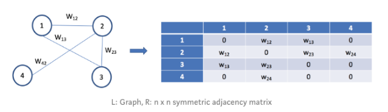

```{r setup, include=FALSE}
options(htmltools.dir.version = FALSE)
xaringanExtra::use_animate_css()
# xaringanExtra::use_scribble()
knitr::opts_chunk$set(
  fig.width = 8, fig.height = 6, fig.retina=5,
  out.width = "50%",
  cache = FALSE,
  echo = FALSE,
  message = FALSE, 
  warning = FALSE,
  hiline = TRUE
)


```

```{r, load_refs, include=FALSE, cache=FALSE}
# remotes::install_github("ROpenSci/bibtex")
library(RefManageR)
BibOptions(check.entries = FALSE,
       bib.style = "authoryear",
       cite.style = "authoryear",
       style = "markdown",
       hyperlink = FALSE,
       dashed = FALSE)
ercim_bib <- ReadBib("ercim22_references.bib", check = FALSE)
```

```{r xaringan-themer, include=FALSE, warning=FALSE}
library(xaringanthemer)
library(xaringanExtra)
library(FactoMineR)
library(GGally)
library("gganimate")
library(ggrepel)
library(magick)
library(palmerpenguins)
library("tidyverse")
library("fpc")
library("factoextra")
library("dbscan")
library("mclust")
library(fastDummies)
library(mlbench)
library(tidyverse)
library(tidymodels)
library(purrr)
library(ca)
library("magick")
library(tidymodels)
library(discrim)
library(clustrd)
library(flipbookr)
library(kableExtra)
library(janitor)
library(patchwork)
library(mvtnorm)
library("ggraph")
library("tidygraph")
source("../R/core_spectral.R")

style_duo_accent(primary_color = "#F9FBFA",
                 secondary_color = "#EA655E",
                 title_slide_background_image = "figures/ercim_2022_logo.png",
                 title_slide_background_position = "bottom",
                 title_slide_background_size= "100%",
                 title_slide_text_color = "#EA655E",
                 code_font_size  = "0.7rem",
                 code_highlight_color="#E4F6EF",
                 header_color = "#37499c"
                 )
                 
style_extra_css(css = list(
  ".my-pull-left"= list(float= "left",
                         width = "10%"),
  ".my-pull-right"= list(float= "right",
                          width = "89%"),
  ".my-pull-right + *" = list(clear = "both")
  ),
  outfile = "xaringan-themer.css",
  append = TRUE)


xaringanExtra::use_tile_view()
```
class: animated fadeIn middle

.my-pull-left[

&nbsp;

&nbsp;

&nbsp;

#### outline


]

.my-pull-right[
>### spectral clustering
>
>### association-based distances for non-continuous data
>
>### experiments
>
>### perspectives
]


---
class: animated fadeIn 

### cluster analysis 
- <h4 style = "color:#37499c"> the general aim is to find homogeneous groups of observations </h4>
  


>    observations from the same group are similar to each other    
>
>    observations from different groups are not similar to each other


--

```{r,fig.align='center', out.width="40%"}
set.seed(1)

cl1 = rmvnorm(100,c(3,4),sigma= matrix(c(.05,0,0,.05),nrow=2)) %>% as_tibble() %>% mutate(true_clust="a")
cl2 = rmvnorm(75,c(2,1),sigma= matrix(c(.1,0,0,.1),nrow=2))%>% as_tibble() %>% mutate(true_clust="b")
cl3 = rmvnorm(100,c(-2,2),sigma= matrix(c(.25,.2,.2,.25),nrow=2))%>% as_tibble() %>% mutate(true_clust="c")
cl4 = rmvnorm(75,c(-4,-2),sigma= matrix(c(1,0,0,.01),nrow=2))%>% as_tibble() %>% mutate(true_clust="d")
cl5 = rmvnorm(75,c(-5,4),sigma= matrix(c(.1,-.05,-.05,.1),nrow=2))%>% as_tibble() %>% mutate(true_clust="e")

easy_clusters =  rbind(cl1,cl2,cl3,cl4,cl5) %>%
  rename(x=V1,y=V2) %>% 
  mutate(kmeans_clust = kmeans(tibble(x,y),centers = 5,
                               nstart = 100)$cluster,
         kmeans_clust = fct(letters[kmeans_clust]),
         hiera_clust = cutree(hclust(dist(tibble(x,y)),
                                     method = "single"),k=5),
         hiera_clust = fct(letters[hiera_clust]),
         gmix_clust = Mclust(tibble(x,y),G = 5)$classification,
         gmix_clust = fct(letters[gmix_clust]),
         dbs_clust = fpc::dbscan(tibble(x,y),eps=1)$cluster,
         dbs_clust = fct(letters[dbs_clust+1]),
         spect_clust = core_spectral(Dist = dist(tibble(x,y)) %>% as.matrix(), K = 5)$labels,
         spect_clust = fct(letters[spect_clust])
  )

easy_clusters %>%
  ggplot(aes(x=x,y=y,shape = true_clust)) + 
  theme_void() + geom_point(size=3.5,alpha=.75)
```


---
class: animated fadeIn

### clustering approaches
> If a cluster structure does underlie the observations at hand

```{r,fig.align='center'}
easy_clusters %>%
  ggplot(aes(x=x,y=y,shape = true_clust)) + 
  theme_void() + geom_point(size=3.5,alpha=.75)
```

---
class: animated fadeIn
### clustering approaches

.my-pull-left[
> partitioning
>
]

.my-pull-right[
```{r,fig.align='center'}
easy_clusters %>%
  ggplot(aes(x=x,y=y,shape = true_clust,color = kmeans_clust)) + 
  theme_void() + geom_point(size=3.5,alpha=.75)
```
]
.footnote[`r Citep(bib=ercim_bib,"MacQueen", before="K-means, ")`]
---
class: animated fadeIn
### clustering approaches

.my-pull-left[
> agglomerative
]

.my-pull-right[
```{r,fig.align='center'}
easy_clusters %>%
  ggplot(aes(x=x,y=y,shape = true_clust,color = hiera_clust)) + 
  theme_void() + geom_point(size=3.5,alpha=.75)
```
]
.footnote[`r Citep(bib=ercim_bib,"kaufman2009finding", before="see, e.g., ")`]

---
class: animated fadeIn
### clustering approaches

.my-pull-left[
> model-based


]

.my-pull-right[
```{r,fig.align='center'}
easy_clusters %>%
  ggplot(aes(x=x,y=y,shape = true_clust,color = gmix_clust)) + 
  theme_void() + geom_point(size=3.5,alpha=.75)
```
]
.footnote[`r Citep(bib=ercim_bib,"mclachlan1988mixture", before="GMM, ")`]


---
class: animated fadeIn
### clustering approaches

.my-pull-left[
> density-based

]

.my-pull-right[
```{r,fig.align='center'}
easy_clusters %>%
  ggplot(aes(x=x,y=y,shape = true_clust,color = dbs_clust)) + 
  theme_void() + geom_point(size=3.5,alpha=.75)
```
]

.footnote[`r Citep(bib=ercim_bib,"ester1996density", before="DBSCAN, ")`]

---
class: animated fadeIn
### clustering approaches

.my-pull-left[
> spectral
> 
]

.my-pull-right[
```{r,fig.align='center'}
easy_clusters %>%
  ggplot(aes(x=x,y=y,shape = true_clust,color = spect_clust)) + 
  theme_void() + geom_point(size=3.5,alpha=.75)
```
]
.footnote[`r Citep(bib=ercim_bib,"ng2001spectral", before="NJW, ")`]

---
class: animated fadeIn
### clustering approaches
>If a cluster structure does underlie the observations at hand, any approach will work

```{r}
multi_s_clusters = multishapes %>% as_tibble() %>% filter(shape!=5) %>%
  mutate(true_clust = fct(letters[shape]),
         true_clust = fct_recode(.f = true_clust,e ="f"),
         kmeans_clust = kmeans(tibble(x,y),
                               centers = 5,nstart=100)$cluster,
         kmeans_clust = fct(letters[kmeans_clust]),
         hiera_clust = cutree(hclust(dist(tibble(x,y))),k=5),
         hiera_clust = fct(letters[hiera_clust]),
         gmix_clust = Mclust(tibble(x,y),G = 5)$classification,
         gmix_clust = fct(letters[gmix_clust]),
         dbs_clust = fpc::dbscan(tibble(x,y),eps=.2)$cluster,
         dbs_clust = fct(letters[dbs_clust]),
         spect_clust = core_spectral(Dist = dist(tibble(x,y)) %>% as.matrix(), K = 5)$labels,
         spect_clust = fct(letters[spect_clust])
  )

multi_s_clusters = multi_s_clusters %>% 
  mutate(spect_scores = core_spectral(Dist = dist(tibble(x,y)) %>%
                                        as.matrix(), K = 5)$spectral_scores)

multi_s_clusters = cbind(multi_s_clusters %>% dplyr::select(-spect_scores),
                         as.matrix(multi_s_clusters %>% dplyr::select(spect_scores))
                         ) %>% as_tibble() %>%  clean_names()

```


--

.my-pull-left[
## or not?
]

.my-pull-right[
```{r,fig.align='center'}
multi_s_clusters %>%
  ggplot(aes(x=x,y=y,shape = true_clust)) + 
  theme_void() + geom_point(size=3.5,alpha=.75)
```
]

--
.center[## not really]

---
class: animated fadeIn
### clustering approaches

.my-pull-left[
> partitioning
> (Kmeans)

]

.my-pull-right[
```{r,fig.align='center'}
multi_s_clusters %>%
  ggplot(aes(x=x,y=y,shape = true_clust,color = kmeans_clust)) + 
  theme_void() + geom_point(size=3.5,alpha=.75)
```
]

---
class: animated fadeIn
### clustering approaches

.my-pull-left[
> agglomerative

]

.my-pull-right[
```{r,fig.align='center'}
multi_s_clusters %>%
  ggplot(aes(x=x,y=y,shape = true_clust,color = hiera_clust)) + 
  theme_void() + geom_point(size=3.5,alpha=.75)
```
]

---
class: animated fadeIn
### clustering approaches

.my-pull-left[
> model-based
> (GMM)

]

.my-pull-right[
```{r,fig.align='center'}
multi_s_clusters %>%
  ggplot(aes(x=x,y=y,shape = true_clust,color = gmix_clust)) + 
  theme_void() + geom_point(size=3.5,alpha=.75)
```
]

---
class: animated fadeIn
### clustering approaches

.my-pull-left[
> density-based
> (dbscan)

]

.my-pull-right[
```{r,fig.align='center'}
multi_s_clusters %>%
  ggplot(aes(x=x,y=y,shape = true_clust,color = dbs_clust)) + 
  theme_void() + geom_point(size=3.5,alpha=.75)
```
]

---
class: animated fadeIn
### clustering approaches

.my-pull-left[
> spectral

]

.my-pull-right[
```{r,fig.align='center'}
multi_s_clusters %>%
  ggplot(aes(x=x,y=y,shape = true_clust,color = spect_clust)) + 
  theme_void() + geom_point(size=3.5,alpha=.75)

```

]


---
class: animated fadeIn inverse center middle

<h1 style = "color:#37499c"> spectral clustering </h1>


---
class: animated fadeIn
### Spectral clustering?


create a weighted undirected graph <span style = "color:#EA655E"> $G(V,E)$ </span>
   out of the $\bf X$ matrix


```{r,fig.align='center',echo=FALSE,out.width="55%"}

```

-  the observations are mapped on the <span style = "color:#EA655E"> vertices </span> of the graph

- each <span style = "color:#EA655E"> edge </span> is weighted according to the <span style = "color:#EA655E"> similarity </span> between the linked vertices/observations 

- pairwise similarities are stored in the so-called <span style = "color:#EA655E"> affinity matrix $\bf A$ </span>

.footnote[www.kaggle.com/code/vipulgandhi/spectral-clustering-detailed-explanation]

---
class: animated fadeIn
### Spectral clustering

#### Defining the affinity matrix ${\bf A}$
- the affinity matrix is <span style = "color:#EA655E"> ${\bf A}=exp(-{\bf D}^{2}(2\sigma^{2})^{-1})$ </span>

-  <span style = "color:#EA655E"> $\bf D$ </span> be the $n\times n$ matrix of pairwise Euclidean distances


- the <span style = "color:#EA655E"> $\sigma$ </span> parameter dictates the number of neighbors each observation is linked to
  - the smaller  $\sigma$, the lower the number observations linked to each other 

- diagonal terms of $\bf A$ are set to zero: <span style = "color:#EA655E"> $a_{ii}=0$ </span>, $i=1,\ldots,n$
 

---
class: animated fadeIn
### Spectral clustering: cutting the graph

.pull-left[
#### the aim is then to partition (cut) <span style = "color:#EA655E"> $G(V,E)$ </span>  into K groups (clusters)

]

.pull-right[
- edges linking vertices from different groups have a low weight

- edges linking vertices from the same group have an high weight

]


--

> Finding an optimal partition of the graph is not easy:
>
> - intuitively, one could pick the partition that minimizes the sum of the weights within each group
> - but that would lead to isolated nodes

---
class: animated fadeIn
### Spectral clustering: cutting the graph

An approximated solution to the graph partitioning problem boils down to the <span style = "color:#EA655E"> spectral decomposition </span> of
<span style = "color:#EA655E"> $${\bf L} ={\bf Q}{\Lambda}{\bf Q}^{\sf T}$$ </span>

where the columns of <span style = "color:#EA655E"> ${\bf Q}$ </span> are the eigenvectors of ${\bf L}$  and <span style = "color:#EA655E"> ${\Lambda}$ </span> is the diagonal matrix of the corresponding eigenvalues (sorted in descending order)
--

&nbsp;

<span style = "color:#EA655E"> $\bf L$ </span> is referred to as  the <span style = "color:#EA655E"> graph Laplacian matrix </span> (symmetrically normalized), given by

<span style = "color:#EA655E">
$$\bf{L} = {\bf D}_{r}^{-1/2}{\bf A}{\bf D}_{r}^{-1/2}$$
</span>

where <span style = "color:#EA655E"> ${\bf D}_{r}=diag({\bf r})$ </span>,
<span style = "color:#EA655E"> ${\bf r}={\bf A}{\bf 1}$ </span> and
<span style = "color:#EA655E"> ${\bf 1}$ </span> is an $n$-dimensional vector of 1's 


&nbsp;

--
the spectral clustering of the $n$ original objects is a <span style = "color:#EA655E"> $K$-means</span> applied on the rows of the matrix <span style = "color:#EA655E"> ${\bf{\tilde Q}}$</span>, containing the first $K$ columns of $\bf Q$

---
class: animated fadeIn
### Spectral clustering: solution


```{r,fig.align='center', echo=FALSE,out.width = "70%"}
p12 = multi_s_clusters %>%
  ggplot(aes(x=spect_scores_1,y=spect_scores_2,color=spect_clust,shape=true_clust))+
  theme_minimal()+geom_point() + theme(legend.position = "none")+ xlab("")+ylab("")+xlim(c(-1,1))+ylim(c(-1,1))

p13 = multi_s_clusters %>%
  ggplot(aes(x=spect_scores_1,y=spect_scores_3,color=spect_clust,shape=true_clust))+
  theme_minimal()+geom_point() + theme(legend.position = "none")+ xlab("")+ylab("")+xlim(c(-1,1))+ylim(c(-1,1))

p14 = multi_s_clusters %>%
  ggplot(aes(x=spect_scores_1,y=spect_scores_4,color=spect_clust,shape=true_clust))+
  theme_minimal()+geom_point() + theme(legend.position = "none")+ xlab("")+ylab("")+xlim(c(-1,1))+ylim(c(-1,1))

p15 = multi_s_clusters %>%
  ggplot(aes(x=spect_scores_1,y=spect_scores_5,color=spect_clust,shape=true_clust))+
  theme_minimal()+geom_point() + theme(legend.position = "none")+ xlab("")+ylab("")+xlim(c(-1,1))+ylim(c(-1,1))

p23 = multi_s_clusters %>%
  ggplot(aes(x=spect_scores_2,y=spect_scores_3,color=spect_clust,shape=true_clust))+
  theme_minimal()+geom_point() + theme(legend.position = "none")+ xlab("")+ylab("")+xlim(c(-1,1))+ylim(c(-1,1))

p24 = multi_s_clusters %>%
  ggplot(aes(x=spect_scores_2,y=spect_scores_4,color=spect_clust,shape=true_clust))+
  theme_minimal()+geom_point() + theme(legend.position = "none")+ xlab("")+ylab("")+xlim(c(-1,1))+ylim(c(-1,1))

p25 = multi_s_clusters %>%
  ggplot(aes(x=spect_scores_2,y=spect_scores_5,color=spect_clust,shape=true_clust))+
  theme_minimal()+geom_point() + theme(legend.position = "none")+ xlab("")+ylab("")+xlim(c(-1,1))+ylim(c(-1,1))

p34 = multi_s_clusters %>%
  ggplot(aes(x=spect_scores_3,y=spect_scores_4,color=spect_clust,shape=true_clust))+
  theme_minimal()+geom_point() + theme(legend.position = "none")+ xlab("")+ylab("")+xlim(c(-1,1))+ylim(c(-1,1))

p35 = multi_s_clusters %>%
  ggplot(aes(x=spect_scores_3,y=spect_scores_5,color=spect_clust,shape=true_clust))+
  theme_minimal()+geom_point() + theme(legend.position = "none")+ xlab("")+ylab("")+xlim(c(-1,1))+ylim(c(-1,1))

p45 = multi_s_clusters %>%
  ggplot(aes(x=spect_scores_4,y=spect_scores_5,color=spect_clust,shape=true_clust))+
  theme_minimal()+geom_point() + theme(legend.position = "none")+ xlab("")+ylab("")+xlim(c(-1,1))+ylim(c(-1,1))

blank_p = ggplot(data=tibble(x=0,y=0),mapping=aes(x,y))+
  theme_void()+xlim(c(-1,1))+ylim(c(-1,1))

blank_p1 = ggplot(data=tibble(x=0,y=0),mapping=aes(x,y))+
  theme_void()+geom_text(label="spectral score 1",size=4)+
  xlim(c(-1,1))+ylim(c(-1,1))

blank_p2 = ggplot(data=tibble(x=0,y=0),mapping=aes(x,y))+
  theme_void()+geom_text(label="spectral score 2",size=4)+xlim(c(-1,1))+ylim(c(-1,1))

blank_p3 = ggplot(data=tibble(x=0,y=0),mapping=aes(x,y))+
  theme_void()+geom_text(label="spectral score 3",size=4)+xlim(c(-1,1))+ylim(c(-1,1))

blank_p4 = ggplot(data=tibble(x=0,y=0),mapping=aes(x,y))+
  theme_void()+geom_text(label="spectral score 4",size=4)+xlim(c(-1,1))+ylim(c(-1,1))

blank_p5 = ggplot(data=tibble(x=0,y=0),mapping=aes(x,y))+
  theme_void()+geom_text(label="spectral score 5",size=4)+xlim(c(-1,1))+ylim(c(-1,1))

(blank_p1 | blank_p | blank_p |  blank_p | blank_p) / 
(p12 | blank_p2 | blank_p | blank_p | blank_p) /
(p13 | p23 | blank_p3 |  blank_p | blank_p) /
(p14 | p24 | p34 |  blank_p4 | blank_p) /
(p15 | p25 | p35 |  p45 | blank_p5) 


```

---
class: animated fadeIn
### Spectral clustering: solution

.pull-left[
```{r,fig.align='center',out.width = "75%"}

ggparcoord(data=multi_s_clusters,columns = 10:14,groupColumn = 9,
           scale="globalminmax",alphaLines = .05 )+
  theme_minimal()+theme(legend.position="none")


```
]

.pull-right[
```{r,fig.align='center',out.width = "85%"}
multi_s_clusters %>%
  ggplot(aes(x=x,y=y,shape = true_clust,color = spect_clust)) + 
  theme_void() + geom_point(size=3.5,alpha=.75)

```
]


---
class: animated fadeIn
### Spectral clustering review: the NJW  procedure

> - step 1: compute the pairwise distances matrix $\bf D$
>
> - step 2: switch to the affinity matrix $\bf A$
>
> - step 3: normalize the affinity matrix to obtain the Laplacian matrix $\bf L$
>
> - step 4: decompose $\bf L$ and obtain ${\bf {\tilde Q}}$
>
> - step 5: apply the $K$-means on ${\bf {\tilde Q}}$ to obtain the cluster allocation vector


--

###  performance

Recent benchmarking studies `r Citep(bib=ercim_bib,"murugesan2021benchmarking", before="e.g., ")` outlined that

- spectral clustering is not the best there is
- but is often among the best performing clustering approaches
- it works well on non-convex and overlapping clusters

---
class: animated fadeIn
### Spectral clustering generalization to non-continuos data

Spectral clustering procedures have been proposed in the literature to deal with 

- categorical datasets `r Citep(bib=ercim_bib,"david2012spectralcat")`

- mixed-type datasets `r Citep(bib=ercim_bib,"mbuga21")`: propose a convex combination of Hamming and Euclidean distances to deal with categorical and continuous variables, respectively

In general the definition of pairwise distances matrix $\bf D$ is key to extend the NJW procedure to mixed data

- along this line, using the Gower dissimilarity is also an option


--

.my-pull-left[
### aim
]


.my-pull-right[
> propose a spectral clustering implementation based, as in `r Citep(bib=ercim_bib,"mbuga21")`, on a convex combination of distances
> - use of the so-called <span style = "color:#EA655E"> total variation distance </span> to take into account the variables association when computing pairwise distances between objects
]

---
class: animated fadeIn inverse center middle

<h1 style = "color:#37499c"> association-based distances </h1>
<h2 style = "color:#37499c"> for categorical variables </h2>


---
class: animated fadeIn
### Association-based distances

When computing distances between multivariate observations, an implicit assumption is the pairwise <span style = "color:#EA655E">independence</span> among the considered variables

- by-variable distances are computed, and then added together
--

  - Euclidean or Manhattan distances for the continuous case
  - Hamming (matching) distance for the categorical case

--

&nbsp;

-----

&nbsp;

> As pointed out in `r Citep(bib=ercim_bib,"vdv_joc", before="e.g., ")`  several recent proposals to compute distances for multivariate categorical observations are <span style = "color:#EA655E">association-based</span>

- for categorical variables, the choice is not obvious nor trivial

---
class: animated fadeIn
### Total variation distance (TVD)

#### basic structures
> - ${\bf X}_{cat}$ is an $n\times q$ matrix of categorical variables, each with $q_{j}$ categories, $j=1,\ldots,q$
> - ${\bf Z}_{j}$ is the one-hot encoded version of the $j^{th}$ variables and ${\bf Z}=\left[Z_{1},Z_{2},\ldots,Z_{q}\right]$
> - ${\bf P}=\frac{1}{n}{\bf Z}^{\sf T}{\bf Z}$ is the matrix co-occurrence proportions

--

#### block matrix of conditional distributions
> given the block matrix ${\bf R} = {\bf P}_{d}^{-1}\left({\bf P}-{\bf P}_{d}\right)$, with ${\bf P}_{d}=diag({\bf P})$ 
>    - the general off-diagonal block is ${\bf R}_{ij}$ ( $q_{i}\times q_{j}$ )
>    - the $a^{th}$ row of ${\bf R}_{ij}$, ${\bf r}^{ij}_{a}$, is the  conditional distribution of the $j^{th}$ variable, given the $a^{th}$ category of the $i^{th}$ variable  

---
class: animated fadeIn
### Total variation distance (TVD)

#### pair-wise dissimilarity between categories
> consider any pair of categories $a$ and $b$ from the $i^{th}$ categorical variable,
> their overall dissimilarity is $\delta^{i}(a,b)$, that is
$$\delta^{i}(a,b)=\sum_{i\neq j}^{q}w_{ij}\Phi^{ij}({\bf r}^{ij}_{a},{\bf r}^{ij}_{b})$$
> upon defining  $$\Phi^{ij}({\bf r}^{ij}_{a},{\bf r}^{ij}_{b})=\frac{1}{2}\sum_{\ell=1}^{q_{j}}|{\bf r}^{ij}_{\ell a}-{\bf r}^{ij}_{\ell b}|$$ 
then $\Phi^{ij}()$ corresponds the total variation distance between two discrete probability distributions

---
class: animated fadeIn
### pairwise object distances (TVD-based)

- For the $i^{th}$ categorical variable, compute $\delta^{i}(a,b)$ for all the possible categories pairs, and store them in the $q_{i}\times q_{i}$ matrix ${\bf \Delta}_{i}$

- define the block-diagonal matrix

$${\bf \Delta}=\begin{bmatrix}
{\bf \Delta}_{1}&             & & & \\
                &{\bf \Delta}_{2} & & & \\
                &                 & \ddots & &  \\
          &                 & & & {\bf \Delta}_{q}\\
\end{bmatrix}$$
- the pairwise object distances matrix is
$${\bf D}_{cat} = {\bf Z}{\bf \Delta}{\bf Z}^{\sf T}$$
---
class: animated fadeIn
###Spectral clustering of mixed data

For a mixed-type data table ${\bf X}={\left[{\bf X}_{con},{\bf X}_{cat}\right]}$ 

Define the distance matrix for each block of variables (continuous and categorical)
-  ${\bf \hat{D}}_{con}$ as the Euclidean distances matrix, re-scaled on the [0,1] range
-  ${\bf \hat{D}}_{cat}$ as the TVD-based distances matrix, re-scaled on the [0,1] range


--
Compute the general distance matrix as

$${\bf D}=\alpha{\bf \hat{D}}_{con}+(1-\alpha){\bf \hat{D}}_{cat}$$
--

Apply the NWJ procedure on ${\bf D}$

- the $\alpha$ parameter can be tuned, its default is $\alpha=.5$

 
---
class: animated fadeIn

### Simulation setup
- the categorical variables are generated as in `r Citep(bib=ercim_bib,"van_de_velden17")`
- the continuous variables are generated as in `r Citep(bib=ercim_bib,"mbuga21")`

.my-pull-left[

&nbsp;

#### factors

]

.my-pull-right[
> 1000 observations
>
> 8 and 16 observations ( $50\%$ active, $50\%$ noise)
>
> balanced and unbalanced clusters
>
> mild and high cluster structure
>
> 10 replicates
]

NWJ implementation based on are compare with the *true* cluster membership via ARI

- Gower distance
- matching + Euclidean  `r Citep(bib=ercim_bib,"mbuga21")`
- TVD-based 

---
class: animated fadeIn

### Results: balanced clusters

```{r, fig.align='center',out.width= "60%"}
load(file="../data/mix_results_boxplot.RData")

sel_scenario_analysis_mix %>% 
  filter(balanced=="yes") %>% 
  ggplot(aes(x=selected_distances,y=spectral_ari,fill=selected_distances)) + 
  geom_boxplot()+facet_wrap(actives~strength)
  
```

---
class: animated fadeIn
### Results: unbalanced clusters

```{r, fig.align='center',out.width= "60%"}
sel_scenario_analysis_mix %>% 
  filter(balanced=="no") %>% 
  ggplot(aes(x=selected_distances,y=spectral_ari,fill=selected_distances)) + 
  geom_boxplot()+facet_wrap(actives~strength)
  

```

---
class: animated fadeIn middle

### future work


> - adopt variable-specific distances 
>
> - distance as an hyperparameter
>
> - discuss metrics other than CH
>
> - compare spectral clustering performance with other approaches for mixed-type data
>

---
class: animated fadeIn

### References

```{r ,echo=FALSE, results='asis', size='tiny'}
PrintBibliography(ercim_bib, start = 1, end = 7 )
```

---
class: animated fadeIn

### References (2)

```{r ,echo=FALSE, results='asis'}
PrintBibliography(ercim_bib, start = 8, end = 14)
```

---
class: animated fadeIn right bottom inverse

### https://alfonsoiodicede.github.io
